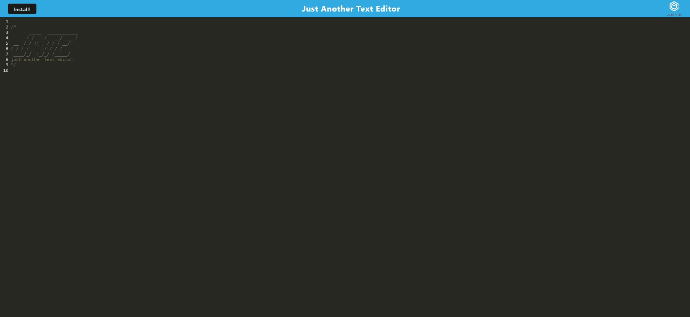

# Text Editor Starter Code

  
## License

  
  
## Deployed URL
  
  https://blooming-spire-77928.herokuapp.com/

## Description

  This is yet another text editor that can be used both online and offline. It also has Progressive Web App (PWA) functionality that allows the user to save the app for use.

  

## Table of Contents 

  
  - [Installation](#installation)
  - [Usage](#usage)
  - [Credits](#credits)
  - [License](#license)   
  - [Tests](#tests)
  - [Questions](#questions)
  

## Installation

Download off of GitHub, ensure all dependencies are installed using npm run install, then npm run start.

## Usage

This app is accessed through http://localhost:3000 when run locally.   

## Credits

https://github.com/toTOEro 
  

## Questions
  
Reach out to me via GitHub or email! 

https://github.com/toTOEro

anthony3738@gmail.com
  
  